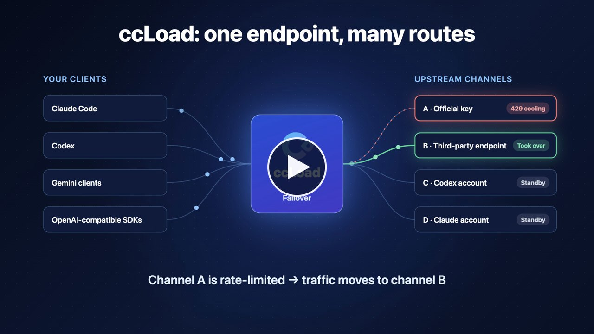

# ccLoad

**Self-hosted AI API gateway for Claude Code, Codex, Gemini, and OpenAI-compatible clients.**

**English | [简体中文](README.zh-CN.md)** · [Website](https://ccload.xyz)

[](https://github.com/caidaoli/ccLoad/releases/latest)
[](https://github.com/caidaoli/ccLoad/actions/workflows/test.yml)
[](go.mod)
[](LICENSE)

[](https://ccload.xyz/assets/video/ccload-promo.en.mp4?v=20261002)

▶ [Watch the 47-second overview](https://ccload.xyz/assets/video/ccload-promo.en.mp4?v=20261002) · [中文版](https://ccload.xyz/assets/video/ccload-promo.zh-CN.mp4?v=20261002)

## What Is ccLoad

You may have several AI sources: official API keys, third-party relay services, and ChatGPT or Claude subscriptions. Each client has to be configured separately, and when one quota runs out or an upstream fails, a running Claude Code or Codex session stops.

ccLoad is a gateway you run on your own computer or server. It manages all of those sources, and every client only needs the ccLoad address and a ccLoad token:

```text
Claude Code / Codex / Gemini / OpenAI-compatible tools
                │  one address + one ccLoad token
                ▼
             ccLoad   pick an upstream → retry the next one on failure → convert protocols if needed → record usage and cost
                │
   ┌────────────┼──────────────┬──────────────────────────┐
Official API keys  Relay services  Codex / Claude and other subscriptions  …
```

Three terms are used throughout the steps below:

- **Channel**: one upstream source, such as "a relay service's URL plus key" or "a signed-in Codex account". Each channel lists the models it serves.
- **API token**: the key ccLoad gives to your clients. Clients only talk to ccLoad with this token and never see the real upstream keys.
- **Admin console**: open `http://your-host:8080/web/` and sign in with the admin password `CCLOAD_PASS` to add channels, create tokens, and view logs and costs.

## Who It's For

- **Developers with several AI subscriptions**: Combine ChatGPT, Claude and other plans with spare API keys, so Claude Code and Codex keep running when one quota runs out.
- **Teams sharing model access**: Give each teammate a token with model, budget and concurrency limits. Upstream credentials stay in one place and access can be revoked at any time.
- **Operators running many channels**: Manage channels with priorities, health-based ordering, scheduled checks, CSV import and export, and a log entry for every request.

## Quick Start

Five steps get Claude Code or Codex working through ccLoad.

### Step 1: Install and start

Pick one method. Every method **requires the admin password `CCLOAD_PASS`**; without it the service exits immediately. The service listens on port `8080` by default.

**Docker (recommended)**:

```bash
docker run -d --name ccload \
  -p 8080:8080 \
  -e CCLOAD_PASS=your_admin_password \
  -v ccload_data:/app/data \
  ghcr.io/caidaoli/ccload:latest
```

Data lives in the Docker volume `ccload_data`, so removing or upgrading the container keeps it.

**Docker Compose**:

```bash
curl -o docker-compose.yml https://raw.githubusercontent.com/caidaoli/ccLoad/master/docker-compose.yml
curl -o .env https://raw.githubusercontent.com/caidaoli/ccLoad/master/.env.docker.example
# Edit .env and set CCLOAD_PASS to your admin password
docker compose up -d
```

**Homebrew (macOS / Linux)**:

```bash
brew tap caidaoli/ccload https://github.com/caidaoli/ccLoad.git
brew install caidaoli/ccload/ccload

# Create .env in the config directory with one line: CCLOAD_PASS=your_admin_password
mkdir -p "$(brew --prefix)/var/ccload"
cd "$(brew --prefix)/var/ccload"
(umask 077; touch .env)
${EDITOR:-vi} .env

brew services start caidaoli/ccload/ccload
```

**Download the binary**: get the file for your platform from [Releases](https://github.com/caidaoli/ccLoad/releases/latest) (`ccload-linux-amd64`, `ccload-linux-arm64`, `ccload-darwin-arm64`, `ccload-darwin-amd64`, `ccload-windows-amd64.exe`). On Linux:

```bash
chmod +x ccload-linux-amd64
CCLOAD_PASS=your_admin_password ./ccload-linux-amd64
```

Data is stored in `data/ccload.db` under the current directory by default.

Without a server, you can deploy for free on Hugging Face Spaces; see [Deployment](docs/guide/deployment.md#method-4-hugging-face-spaces-deployment).

Check that the service is up:

```bash
curl http://localhost:8080/health
```

> On a server, replace every `localhost` in this guide with the server's IP address or domain.

### Step 2: Sign in to the admin console

Open `http://localhost:8080/web/` and sign in with the `CCLOAD_PASS` from step 1.

### Step 3: Add a channel

Go to **Channels** and click **Add Channel**:

- **API-key upstreams** (official APIs, relay services): the easiest way is **Auto-fill channel configuration**. Paste the address and key your provider gave you (for example `OPENAI_BASE_URL=https://api.example.com` and `OPENAI_API_KEY=sk-...`); ccLoad checks the connection and fetches the model list. When filling the form by hand, enter only the base URL, without `/v1` or an endpoint path.
- **Subscription accounts** (Codex/ChatGPT, Claude, Antigravity, xAI, CodeBuddy, Z.ai Coding Plan, Cursor, Zed): choose the account type in Channels and follow the prompts to authorize in the browser or import credentials.

**The model list decides whether a channel is used.** ccLoad picks channels by the model name the client requests: if the client asks for `claude-sonnet-4-6`, some channel must list `claude-sonnet-4-6`. Add models with **Fetch Models** or **Common Models**; when the upstream uses a different name, put the upstream name in **Redirect Target**.

After saving, click **Test** on the channel to confirm it responds.

### Step 4: Create an API token

Go to **API Tokens** (`/web/tokens.html`), create a token and copy it. Every client uses it to reach ccLoad; `/v1/*` and `/v1beta/*` requests without a token return `401`.

### Step 5: Point your clients at ccLoad

Test with curl first. Replace `your-api-token` with the token from step 4 and the model with one configured on your channel:

```bash
curl -X POST http://localhost:8080/v1/messages \
  -H "Content-Type: application/json" \
  -H "Authorization: Bearer your-api-token" \
  -H "anthropic-version: 2023-06-01" \
  -d '{
    "model": "claude-sonnet-4-6",
    "max_tokens": 1024,
    "messages": [{"role": "user", "content": "Hello, Claude!"}]
  }'
```

**Claude Code**:

```bash
export ANTHROPIC_BASE_URL=http://localhost:8080
export ANTHROPIC_AUTH_TOKEN=your-api-token
claude
```

Add the exports to `~/.zshrc` or `~/.bashrc` to keep them.

**Codex CLI**: log in with your ccLoad token, then change the address:

```bash
echo your-api-token | codex login --with-api-key
```

```toml
# ~/.codex/config.toml
openai_base_url = "http://localhost:8080/v1"
```

**Other OpenAI-compatible tools** (Cherry Studio, SDKs, and so on): set the base URL to `http://localhost:8080/v1` and the API key to your ccLoad token.

The client protocol does not have to match the upstream; ccLoad converts between them when they differ. More endpoints and options are in the [Usage Guide](docs/guide/usage.md).

## Troubleshooting

- **The service exits right after starting**: `CCLOAD_PASS` is not set. If the password contains `$`, wrap it in single quotes in `.env`, for example `CCLOAD_PASS='abc$def'`.
- **Requests return `401`**: the client sends no token or a wrong one. Use the ccLoad token from step 4, not an upstream key or the admin password.
- **`404 model: xxx` or `503 no available upstream`**: no channel lists that model name, or every usable channel is cooling down. Check the channel's model list and see each attempt's failure reason on the **Logs** page.
- **Port 8080 is in use**: set the `PORT` environment variable, or change the left side of `-p` for Docker.
- **Other machines cannot connect**: check the firewall and port mapping. For public deployments, put ccLoad behind an HTTPS reverse proxy; see [Security](#security).

## Why ccLoad

A reverse proxy forwards requests. ccLoad is built for coding agents that stream long responses, run for hours, and spend real money, so every design choice is about keeping the session alive and the bill predictable.

- **Subscription accounts, not just API keys**: Sign in Codex (ChatGPT), Claude, Antigravity, xAI, CodeBuddy, Z.ai Coding Plan, Cursor and Zed accounts as channels. Tokens refresh automatically, and quota usage is tracked against each provider's reset window.
- **Any client on any upstream**: Anthropic Messages, OpenAI Chat, Codex Responses and Gemini clients can all use every channel that serves the model. Requests and streamed responses are converted when the protocols differ, including Codex Responses over WebSocket.
- **Failover your client never sees**: If an upstream fails before the first byte reaches the client, ccLoad retries the next candidate. Errors disguised as HTTP 200 and rate limits inside SSE streams count as failures too.
- **Cooldown at the right scope**: A revoked key, a rate-limited model, or a dead URL cools down on its own with exponential backoff and honors upstream reset times. The rest of the channel keeps serving.
- **Cost you can check and cap**: Pricing covers cache reads and writes, long-context tiers, OpenAI `service_tier` and image generation. Cap spend per channel per day and per token in total, per day or per month.
- **Light to run**: One Go binary with embedded SQLite and a built-in admin console. Add MySQL or PostgreSQL only when you need them, or run it for free on Hugging Face Spaces.

## Features

### Routing and failover

- **Priority routing**: High-priority channels are selected first; channels at the same priority use smooth weighted round-robin, with health-based dynamic sorting.
- **Scoped failover**: Errors are classified as key-, model-, channel-, or client-level, and only the failed scope is skipped. Cooldowns use one exponential-backoff policy and honor explicit upstream reset times.
- **Model-aware cooldown**: A failing model cools down alone; other models on the same channel stay available. The channel cools only when every configured model or every enabled key is cooling.
- **Soft-error detection**: HTTP 200 responses that carry an error body, SSE `error` events with explicit rate limits, and quota errors trigger the same failover path as regular upstream failures.
- **Multiple URLs per channel**: Latency-weighted selection with independent per-URL cooldown.
- **Channel limits**: Daily cost, RPM, concurrency, availability time window, and per-key model allowlists take a channel out of routing without cooling it.
- **Per-channel upstream proxy**: http/https/socks5/socks5h, with isolated connection pools.
- **Scheduled checks**: Background probing detects failed channels.

### Protocols and clients

- **Four client protocols on every channel**: Anthropic, OpenAI, Codex (Responses), and Gemini. Each upstream URL declares the wire protocols it accepts, or ccLoad detects and caches them; requests are converted between protocols when client and upstream differ.
- **Responses WebSocket**: Codex clients keep a downstream WebSocket while each candidate uses native Codex WebSocket or HTTP/SSE.
- **Account-based channels**: Codex (ChatGPT) OAuth and personal access tokens, Anthropic (Claude), Antigravity, and xAI OAuth, Z.ai Coding Plan, Cursor, and Zed, with token refresh where supported, batch import, quota refresh, and automatic disabling of permanently rejected credentials.
- **Model thinking suffix**: `model(high)` or `model(16384)` maps to the upstream protocol's thinking parameters while routing uses the base model name.
- **Multimodal fallback**: Requests with images or files are moved from non-vision models to configured fallback models before routing.
- **Custom request rules**: Per-channel header and JSON body rewriting, with protected authentication headers.
- **Local token counting**: `/v1/messages/count_tokens` is answered locally without an upstream call.

### Cost and access control

- **API tokens**: Per-token cost limits, model restrictions, channel allowlist/denylist, and concurrency caps. Upstream credentials stay in the gateway.
- **Cost accounting**: OpenAI `service_tier` multipliers, tiered long-context pricing, cache-token discounts, and image-generation tool billing.
- **OAuth quota cost**: Per-credential weekly and monthly standard cost aligned with upstream quota windows.
- **Read-only token login**: An API token can sign in to the web console and see only its own usage.

### Observability

- **Dashboard**: Active requests, trends, logs, token usage, time to first byte, and cost by channel, model, and token, plus process metrics (CPU, RSS, GC).
- **Request control**: Abort an in-flight request from the logs page; it fails over like an upstream disconnect.
- **Debug logs**: Raw upstream request and response capture with sensitive headers masked.
- **Model testing workbench**: Test by channel, by model, or in a chat, with image upload, reasoning level, built-in search, and image generation.


### Deployment

- **Single binary** with embedded SQLite; MySQL or PostgreSQL optional, including a hybrid mode that keeps SQLite on the hot path.
- **Multi-arch Docker images** (`linux/amd64`, `linux/arm64`) on GHCR, and Hugging Face Spaces deployment.
- **Release channels**: Stable or preview updates, verified by SHA-256 before the binary is replaced; containers update by pulling a new tag.
- **CSV import and export** for channel configuration.

## How It Works


A request is authenticated with a ccLoad token, matched to candidate channels by model, priority, and limits, and forwarded to an upstream URL and key. If the upstream fails before any output reaches the client, ccLoad cools the failed scope and retries the next candidate. Protocol conversion happens only when the client protocol and the selected upstream protocol differ. Details: [Architecture](docs/guide/architecture.md).

## Documentation

| Topic | Contents |
|-------|----------|
| [Deployment](docs/guide/deployment.md) | Docker, binary, source build, Hugging Face Spaces, databases, image tags, updates, troubleshooting |
| [Usage Guide](docs/guide/usage.md) | API endpoints, Codex CLI and Responses WebSocket, thinking suffix, channel management, request rules, CSV import/export, admin console |
| [Configuration](docs/guide/configuration.md) | Environment variables, storage modes, system settings, channel sorting, API tokens, authentication |
| [Architecture](docs/guide/architecture.md) | Protocol routing, dependencies, module layout, database structure |

The website has the same topics as guided pages: [Install](https://ccload.xyz/install.html) · [Configure](https://ccload.xyz/config.html) · [Use](https://ccload.xyz/usage.html) · [Feedback](https://ccload.xyz/feedback.html).

## Security

- Set a strong `CCLOAD_PASS`; the service does not start without one.
- Give clients ccLoad API tokens, never upstream keys. Tokens are managed at `/web/tokens.html`.
- Upstream API keys and account credentials are stored in the database and included in CSV exports. Protect the database and delete exported files after use.
- The browser stores only a random web-session token that expires after 24 hours.
- Put the service behind an HTTPS reverse proxy, and set `TRUSTED_PROXIES` so forwarded client addresses cannot be spoofed.

## Contributing

Issues and pull requests are welcome: https://github.com/caidaoli/ccLoad/issues

Go commands need the `sonic` build tag. Before sending a change, run the checks that match the touched area:

```bash
go test -tags sonic ./internal/...
make verify-web     # frontend node:test checks
make race-fast      # race-sensitive packages; make race for the full suite
golangci-lint run ./...
bash .agents/skills/sync-cliproxy-core/scripts/verify.sh --tests  # protocol translation changes
```

## License

MIT License. The synchronized translator snapshot under `internal/protocol/cliproxy` retains its upstream [MIT notice](internal/protocol/cliproxy/LICENSE) and [provenance record](internal/protocol/cliproxy/UPSTREAM.md).
