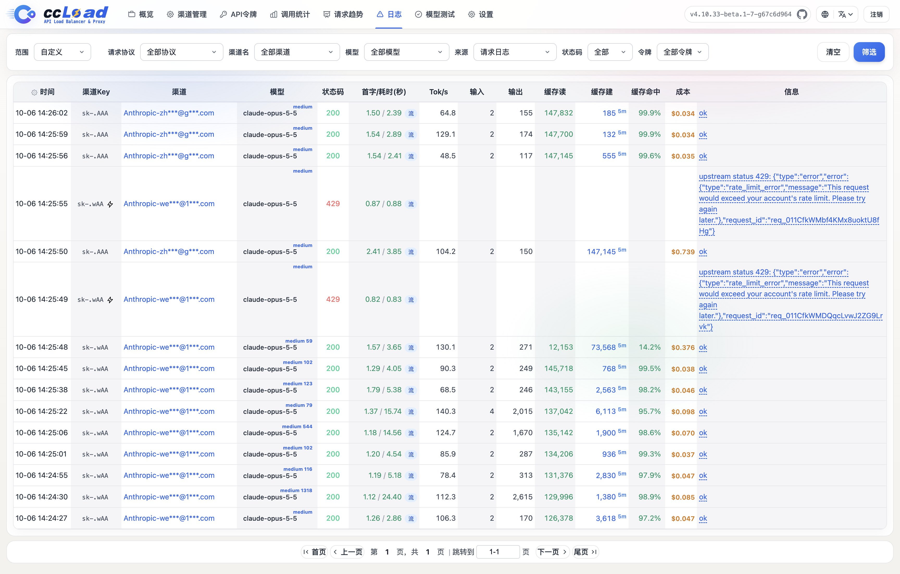

# ccLoad

**自托管的 AI API 网关，面向 Claude Code、Codex、Gemini 和 OpenAI 兼容客户端。**

**[English](README.md) | 简体中文** · [官网](https://ccload.xyz/zh/)

[](https://github.com/caidaoli/ccLoad/releases/latest)
[](https://github.com/caidaoli/ccLoad/actions/workflows/test.yml)
[](go.mod)
[](LICENSE)

[](https://ccload.xyz/assets/video/ccload-promo.zh-CN.mp4?v=20261002)

▶ [观看 47 秒介绍视频](https://ccload.xyz/assets/video/ccload-promo.zh-CN.mp4?v=20261002) · [English](https://ccload.xyz/assets/video/ccload-promo.en.mp4?v=20261002)

## ccLoad 是什么

你手上可能有好几个 AI 来源：官方 API Key、第三方中转站、ChatGPT 或 Claude 订阅账号。每个客户端都得单独配置，某个额度用完或者上游出错，正在跑的 Claude Code、Codex 任务就会中断。

ccLoad 是一个运行在你自己电脑或服务器上的网关程序。你把所有 AI 来源都交给它管理，客户端只需要配置 ccLoad 的地址和一个 ccLoad 令牌：

```text
Claude Code / Codex / Gemini / 各类 OpenAI 兼容工具
                │  只配置一个地址 + 一个 ccLoad 令牌
                ▼
             ccLoad   挑选可用上游 → 失败自动换下一个 → 必要时转换协议 → 记录用量和费用
                │
   ┌────────────┼──────────────┬──────────────────┐
官方 API Key   第三方中转站   Codex / Claude 等订阅账号   ……
```

先了解三个概念，后面的步骤都围绕它们：

- **渠道**：一个上游来源，例如“某中转站的地址 + Key”或“一个已登录的 Codex 账号”。每个渠道要写明它能提供哪些模型。
- **API 令牌**：ccLoad 发给客户端使用的密钥。客户端只认识 ccLoad 和这个令牌，接触不到真实的上游 Key。
- **管理后台**：浏览器打开 `http://服务地址:8080/web/`，用管理密码 `CCLOAD_PASS` 登录，在这里添加渠道、创建令牌、查看日志和费用。

## 适合谁用

- **手上有多个 AI 订阅的开发者**：把 ChatGPT、Claude 等订阅和闲置 API Key 合在一起，一个额度用完，Claude Code 和 Codex 也不会停下来。
- **共享模型访问的团队**：给每个成员发一个令牌，限定模型、预算和并发。上游凭证集中保管，随时可以撤销访问。
- **管理大量渠道的运营者**：用优先级、健康度排序、定时检测、CSV 导入导出管理渠道，每个请求都有日志可查。

## 快速开始

下面五步走完，就能让 Claude Code 或 Codex 通过 ccLoad 工作。

### 第 1 步：安装并启动

任选一种方式。所有方式都**必须设置管理密码 `CCLOAD_PASS`**，未设置时服务会直接退出。服务默认监听 `8080` 端口。

**Docker（推荐）**：

```bash
docker run -d --name ccload \
  -p 8080:8080 \
  -e CCLOAD_PASS=换成你的管理密码 \
  -v ccload_data:/app/data \
  ghcr.io/caidaoli/ccload:latest
```

数据保存在 Docker 卷 `ccload_data` 里，删除或升级容器都不会丢失。

**Docker Compose**：

```bash
curl -o docker-compose.yml https://raw.githubusercontent.com/caidaoli/ccLoad/master/docker-compose.yml
curl -o .env https://raw.githubusercontent.com/caidaoli/ccLoad/master/.env.docker.example
# 编辑 .env，把 CCLOAD_PASS 改成你的管理密码
docker compose up -d
```

**Homebrew（macOS / Linux）**：

```bash
brew tap caidaoli/ccload https://github.com/caidaoli/ccLoad.git
brew install caidaoli/ccload/ccload

# 在配置目录创建 .env，写入一行：CCLOAD_PASS=你的管理密码
mkdir -p "$(brew --prefix)/var/ccload"
cd "$(brew --prefix)/var/ccload"
(umask 077; touch .env)
${EDITOR:-vi} .env

brew services start caidaoli/ccload/ccload
```

**直接下载程序**：从 [Releases](https://github.com/caidaoli/ccLoad/releases/latest) 下载对应平台的文件（`ccload-linux-amd64`、`ccload-linux-arm64`、`ccload-darwin-arm64`、`ccload-darwin-amd64`、`ccload-windows-amd64.exe`），以 Linux 为例：

```bash
chmod +x ccload-linux-amd64
CCLOAD_PASS=你的管理密码 ./ccload-linux-amd64
```

数据默认保存在当前目录的 `data/ccload.db`。

没有服务器也可以免费部署到 Hugging Face Spaces，步骤见[部署文档](docs/guide/deployment.zh-CN.md#方式四hugging-face-spaces-部署)。

确认服务已启动：

```bash
curl http://localhost:8080/health
```

> 部署在服务器上时，把本文所有 `localhost` 换成服务器的 IP 或域名。

### 第 2 步：登录管理后台

浏览器打开 `http://localhost:8080/web/`，输入第 1 步设置的 `CCLOAD_PASS` 登录。

### 第 3 步：添加渠道

进入 **渠道管理** 页，点击 **添加渠道**：

- **API Key 类上游**（官方 API、第三方中转站）：最简单的是点 **一键填充渠道配置**，粘贴服务商给你的地址和 Key（例如 `OPENAI_BASE_URL=https://api.example.com` 和 `OPENAI_API_KEY=sk-...`），ccLoad 会检查连通性并自动拉取模型列表。手动填写时，API URL 只填基础地址，不要带 `/v1` 或具体接口路径。
- **订阅账号**（Codex/ChatGPT、Claude、Antigravity、xAI、CodeBuddy、Z.ai Coding Plan、Cursor、Zed）：在渠道管理中选择对应的账号类型，按页面提示在浏览器授权或导入凭证。

**模型列表决定渠道会不会被选中。** ccLoad 按客户端请求的模型名挑选渠道：客户端要 `claude-sonnet-4-6`，就必须有渠道配置了 `claude-sonnet-4-6`。可以用 **获取模型** 或 **常用模型** 按钮添加；上游的模型名和客户端不一样时，在 **重定向目标** 里填上游的模型名。

保存后在渠道上点 **测试**，确认能正常返回。

### 第 4 步：创建 API 令牌

进入 **API令牌** 页（`/web/tokens.html`），新建一个令牌并复制。所有客户端都用它访问 ccLoad；不带令牌的 `/v1/*` 和 `/v1beta/*` 请求一律返回 `401`。

### 第 5 步：让客户端连接 ccLoad

先用 curl 测一下，把 `your-api-token` 换成第 4 步的令牌，模型换成渠道里配置的模型名：

```bash
curl -X POST http://localhost:8080/v1/messages \
  -H "Content-Type: application/json" \
  -H "Authorization: Bearer your-api-token" \
  -H "anthropic-version: 2023-06-01" \
  -d '{
    "model": "claude-sonnet-4-6",
    "max_tokens": 1024,
    "messages": [{"role": "user", "content": "Hello, Claude!"}]
  }'
```

**Claude Code**：

```bash
export ANTHROPIC_BASE_URL=http://localhost:8080
export ANTHROPIC_AUTH_TOKEN=your-api-token
claude
```

写进 `~/.zshrc` 或 `~/.bashrc` 可以长期生效。

**Codex CLI**：先用 ccLoad 令牌登录，再修改地址：

```bash
echo your-api-token | codex login --with-api-key
```

```toml
# ~/.codex/config.toml
openai_base_url = "http://localhost:8080/v1"
```

**其他 OpenAI 兼容工具**（Cherry Studio、各类 SDK 等）：Base URL 填 `http://localhost:8080/v1`，API Key 填 ccLoad 令牌。

客户端用的是哪种协议都可以，ccLoad 会在客户端协议和上游协议不一致时自动转换。更多接口与用法见[使用说明](docs/guide/usage.zh-CN.md)。

## 常见问题

- **服务启动后立即退出**：没有设置 `CCLOAD_PASS`。密码里包含 `$` 时，在 `.env` 中要用单引号包起来，例如 `CCLOAD_PASS='abc$def'`。
- **请求返回 `401`**：客户端没带令牌或令牌填错。确认填的是第 4 步创建的 ccLoad 令牌，而不是上游 Key 或管理密码。
- **返回 `404 model: xxx` 或 `503 no available upstream`**：没有任何渠道配置了这个模型名，或者能用的渠道都在冷却。检查渠道的模型列表，并到 **日志** 页查看每次尝试的失败原因。
- **8080 端口被占用**：设置环境变量 `PORT` 换一个端口，Docker 则修改 `-p` 左侧的端口。
- **其他机器访问不了**：检查防火墙和端口映射。公网部署请放在 HTTPS 反向代理之后，见下文[安全](#安全)。

## 它和普通 API 中转有什么不同

反向代理只负责转发。ccLoad 面向的是会长时间流式输出、连续运行数小时、并且真金白银计费的编程智能体，所有设计都围绕两件事：会话不断、账单可控。

- **订阅账号也能当渠道，不只是 API Key**：把 Codex（ChatGPT）、Claude、Antigravity、xAI、CodeBuddy、Z.ai Coding Plan、Cursor、Zed 账号接入为渠道。令牌自动刷新，额度用量按各家的重置窗口统计。
- **任意客户端用任意上游**：Anthropic Messages、OpenAI Chat、Codex Responses、Gemini 四种客户端都能使用任何提供该模型的渠道。协议不同时自动转换请求和流式响应，Codex 的 Responses WebSocket 也一样。
- **客户端无感的故障切换**：上游在首字节到达客户端之前失败，ccLoad 就直接重试下一个候选渠道。伪装成 HTTP 200 的错误、SSE 流里的限流标记同样按失败处理。
- **按准确范围冷却**：失效的 Key、被限流的模型、不可用的 URL 各自按指数退避冷却，并遵循上游给出的重置时间；同一渠道的其余部分照常服务。
- **成本可核对、可封顶**：计价覆盖缓存读写、长上下文分档、OpenAI `service_tier` 和图片生成。可按渠道设每日限额，按令牌设总额、每日和每月限额。
- **部署轻量**：一个 Go 二进制，内置 SQLite 和管理后台。需要时再接 MySQL 或 PostgreSQL，也可以免费跑在 Hugging Face Spaces 上。

## 功能

### 路由与容错

- **优先级路由**：高优先级渠道优先使用，同级渠道按平滑加权轮询分流，并按健康度动态排序。
- **按作用域故障切换**：错误分为 Key 级、模型级、渠道级和客户端级，只跳过出问题的那一层。冷却统一使用指数退避，上游给出明确恢复时间时以它为准。
- **模型感知冷却**：单个模型故障只冷却该模型，同渠道其他模型继续可用；只有所有配置模型或所有启用 Key 都在冷却时才冷却整个渠道。
- **软错误检测**：HTTP 200 但响应体是错误、SSE `error` 事件中的明确限流、额度用尽错误，都走和普通上游故障相同的切换路径。
- **单渠道多 URL**：按延迟加权选择，每个 URL 独立冷却。
- **渠道限制**：每日成本、RPM、并发、可用时段和 Key 模型白名单会让渠道退出选路，但不触发冷却。
- **渠道级上游代理**：支持 http/https/socks5/socks5h，连接池相互隔离。
- **定时检测**：后台探测，自动发现故障渠道。

### 协议与客户端

- **每个渠道接受四种客户端协议**：Anthropic、OpenAI、Codex（Responses）和 Gemini。每个上游 URL 可声明支持的线协议，留空则由 ccLoad 探测并缓存；客户端协议与上游不一致时自动转换。
- **Responses WebSocket**：Codex 客户端保持下游 WebSocket，各候选渠道使用原生 Codex WebSocket 或 HTTP/SSE。
- **账号类渠道**：Codex（ChatGPT）OAuth 与个人访问令牌、Anthropic（Claude）、Antigravity、xAI OAuth，以及 Z.ai Coding Plan、Cursor、Zed；支持的提供商自动刷新令牌，可批量导入、刷新额度，凭证被上游永久拒绝时自动禁用。
- **模型思考后缀**：`model(high)` 或 `model(16384)` 映射为上游协议的思考参数，选路仍按基础模型名。
- **多模态回退**：含图片或文件的请求在选路前从非视觉模型改用配置的回退模型。
- **自定义请求规则**：渠道级请求头和 JSON 请求体改写，认证头受保护。
- **本地 Token 计数**：`/v1/messages/count_tokens` 在本地计算，不调用上游。

### 成本与权限

- **API 令牌**：每个令牌可设费用上限、模型限制、渠道白名单/黑名单和并发上限。上游凭证留在网关。
- **成本核算**：OpenAI `service_tier` 倍率、长上下文分层定价、缓存 Token 折扣和图像生成工具计费。
- **OAuth 额度成本**：按凭证累计周/月标准成本，对齐上游额度窗口。
- **令牌只读登录**：API 令牌可登录管理后台，只能查看自己的用量。

### 可观测

- **数据面板**：活跃请求、趋势、日志、Token 用量、首字节时间，以及按渠道、模型和令牌统计的费用，另有进程指标（CPU、RSS、GC）。
- **请求控制**：在日志页中断进行中的请求，按上游断链处理并触发故障切换。
- **调试日志**：捕获上游请求和响应原文，敏感头脱敏。
- **模型测试工作台**：按渠道、按模型或对话方式测试，支持图片上传、思考等级、内置搜索和图片生成。




### 部署

- **单个二进制文件**，内嵌 SQLite；可选 MySQL 或 PostgreSQL，以及让 SQLite 留在热路径上的混合模式。
- **多架构 Docker 镜像**（`linux/amd64`、`linux/arm64`）发布在 GHCR，也可部署到 Hugging Face Spaces。
- **更新渠道**：稳定版或测试版，替换二进制前校验 SHA-256；容器通过拉取新 Tag 更新。
- **CSV 导入导出**渠道配置。

## 工作原理


请求先用 ccLoad 令牌认证，再按模型、优先级和限制匹配候选渠道，转发到某个上游 URL 和 Key。上游在任何输出到达客户端之前失败时，ccLoad 冷却出问题的那一层并尝试下一个候选。只有客户端协议和所选上游协议不一致时才做协议转换。详见[架构](docs/guide/architecture.zh-CN.md)。

## 文档

| 主题 | 内容 |
|------|------|
| [部署](docs/guide/deployment.zh-CN.md) | Docker、二进制、源码编译、Hugging Face Spaces、数据库、镜像标签、更新、故障排除 |
| [使用说明](docs/guide/usage.zh-CN.md) | API 端点、Codex CLI 与 Responses WebSocket、思考后缀、渠道管理、请求规则、CSV 导入导出、管理后台 |
| [配置说明](docs/guide/configuration.zh-CN.md) | 环境变量、存储模式、系统设置、渠道排序、API 令牌、认证 |
| [架构](docs/guide/architecture.zh-CN.md) | 协议路由、依赖、模块划分、数据库结构 |

官网以引导页的形式覆盖相同主题：[安装](https://ccload.xyz/zh/install.html) · [配置](https://ccload.xyz/zh/config.html) · [使用](https://ccload.xyz/zh/usage.html) · [反馈](https://ccload.xyz/zh/feedback.html)。

## 安全

- 设置强密码 `CCLOAD_PASS`；未设置时服务不会启动。
- 给客户端发 ccLoad API 令牌，不要发上游 Key。令牌在 `/web/tokens.html` 管理。
- 上游 API Key 和账号凭证保存在数据库中，CSV 导出也包含它们。保护好数据库，导出文件用完即删。
- 浏览器只保存随机的 Web 会话令牌，24 小时过期。
- 部署在 HTTPS 反向代理之后，并设置 `TRUSTED_PROXIES`，避免伪造转发的客户端地址。

## 贡献

欢迎提交 Issue 和 PR：https://github.com/caidaoli/ccLoad/issues

Go 命令必须带 `sonic` 构建标签。提交改动前，按影响范围运行对应验证：

```bash
go test -tags sonic ./internal/...
make verify-web     # 前端 node:test 验证
make race-fast      # 并发敏感包；全量使用 make race
golangci-lint run ./...
bash .agents/skills/sync-cliproxy-core/scripts/verify.sh --tests  # 协议转换有改动时
```

## 许可证

MIT License。`internal/protocol/cliproxy` 下的同步转换核心保留其上游 [MIT 许可证](internal/protocol/cliproxy/LICENSE)与[来源记录](internal/protocol/cliproxy/UPSTREAM.md)。
